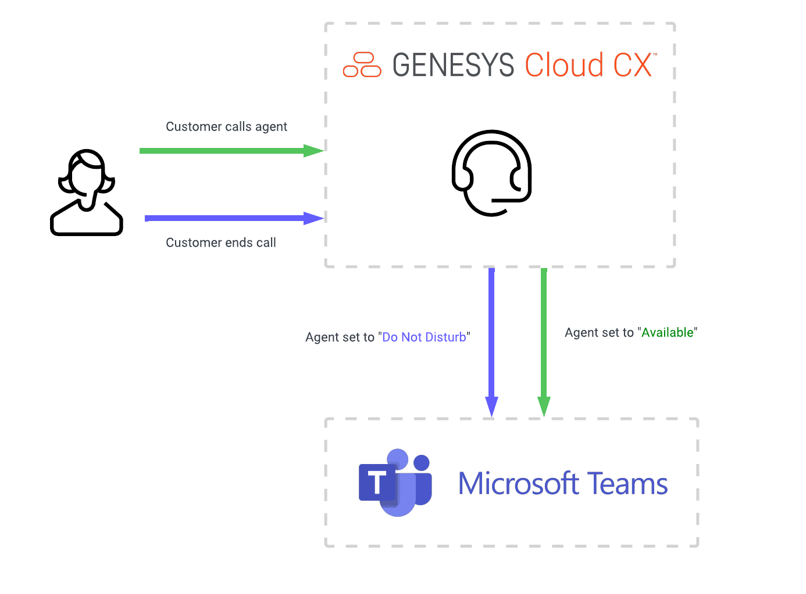

# update-ms-teams-presence-from-inbound-interaction-trigger (DRAFT)
This Genesys Cloud Developer Blueprint explains how to set up Genesys Cloud and Microsoft Azure Active Directory for a Genesys Cloud agent's Microsoft Teams presence to be updated upon the start and end of an inbound Genesys Cloud voice interaction. When an architect workflow receives an inbound interaction, a Microsoft Graph API call will be sent to the Teams user associated with the Genesys Cloud agent assigned to the interaction.  The Teams user's presence will be set to "Do Not Disturb" when the voice interaction begins.  When the interaction ends, the MS Teams user will be returned to "Available".
The following illustration shows the presence solution from an agent’s point of view.

The following shows the end to end agent experience this blueprint enables.

To enable Microsoft Teams presence updates to be triggered from Genesys Cloud, you use several public APIs that are available from Genesys Cloud and Microsoft Graph. The following illustration shows the API calls between Genesys Cloud and Microsoft 365.

