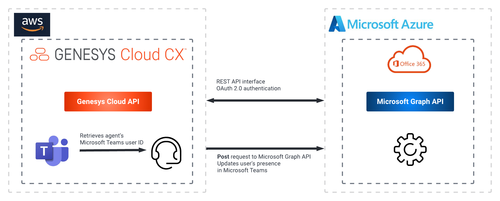

# update-ms-teams-presence-from-inbound-interaction-trigger (DRAFT)
  This Genesys Cloud Developer Blueprint explains how to set up Genesys Cloud and Microsoft Azure Active Directory to update a Genesys Cloud agent's presence in Microsoft Teams at the start and end of an inbound Genesys Cloud voice interaction.

  When an Architect workflow receives an inbound interaction, a Microsoft Graph API call is sent to the Microsoft Teams user that is associated with the Genesys Cloud agent who is assigned to the interaction. The Microsoft Teams user's presence is set to "Do Not Disturb" when the voice interaction begins. When the interaction ends, the Microsoft Teams user's presence is set to "Available."

The following shows the end-to-end agent experience that this solution enables.

To trigger Microsoft Teams presence updates from Genesys Cloud, you use several public APIs that are available from Genesys Cloud and Microsoft Graph. The following illustration shows the API calls between Genesys Cloud and Microsoft 365.

